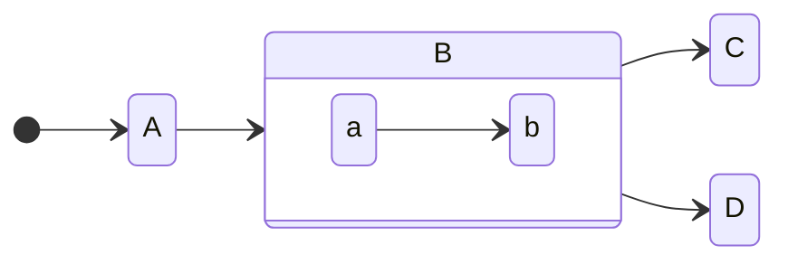

# Syntax

Emanote でサポートされている拡張 MD のシンタックスについて

## 見出し

# H1

## H2

### H3

#### H4

##### H5

## 文章

こんにちは。

あいうえお。

## Links

```md
<!-- 普通のリンク(相対パスやanchorも使用可) -->

[emanote 公式](https://emanote.srid.ca/)

<!-- Wiki-Links(相対パスやanchorにはまだ対応していない) -->

[[ファイル名(拡張子は不要)]]

[[ファイル名|リンクのタイトル]]
```

[Emanote 公式](https://emanote.srid.ca/)

[[test1]]

[[test1|テストページ1へのリンクDESU]]

Wiki-Links のシンタックスの詳細は[ここ](https://github.com/EmaApps/emanote/blob/master/src/Emanote/Pandoc/Markdown/Syntax/WikiLink.hs)

> 現状、普通の md のリンクのほうが機能は充実しているので無理に wiki-links を使う必要はない

### ページ一覧クエリ

`````md
<!-- 一覧表示したいページのクエリを指定 -->

```query
path:emanote/*
```
`````

```query
path:emanote/*
```

[詳細](https://emanote.srid.ca/guide/query)

## 脚注 (Footnotes)

脚注[^1]のデモ.

ほげほげほげ[^2]ふがふがふが[^1]もげ

[^1]: これは脚注 1 です
[^2]: koreha 脚注 2 dayo

## コードブロック

```ts
const a = "a text";
const b = 123;

console.log(`${a} ${b}`);
```

## 数式

MathJax

$a^2 + b ^ 2 = c$ ← 右クリで MathJax のメニュー

## Mermaid

````md

````


## Definition lists

Fruits
: Apples
: Oranges

## Hash Tags

`#tag名` で hash tag

#emanote #hoge

階層構造を持てる

#emanote/howto/syntax

## styling

commonmark の attributes extension 形式での CSS クラス名指定に対応している

基本的に styling は tailwind で行う

自前のカスタムクラスは基本的に index.yaml で書く

またビルトインのデフォルトカスタムクラスがいくつか存在する

### 例

:::{.sticky-note}
**.sticky-note**

スティッキーノート
:::

:::{.highlight-block}
**.highlight-block**

ハイライトブロック
:::

ビルトインのデフォルトカスタムクラスは[この辺](https://github.com/EmaApps/emanote/blob/40c4791f9fda5ef77061e255b6182c9611808c45/default/index.yaml#L46)

## 埋め込み

他のページ、あるいは画像や動画ファイルを埋め込みできる(画像や動画に関しては拡張子が必要)

対応している画像や動画の拡張子一覧は[この辺](https://github.com/EmaApps/emanote/blob/40c4791f9fda5ef77061e255b6182c9611808c45/src/Emanote/Pandoc/Renderer/Embed.hs#L87-L103)

```md
![[ファイル名]]
```

![[test1]]
